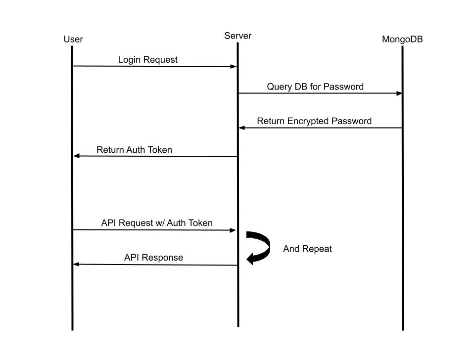
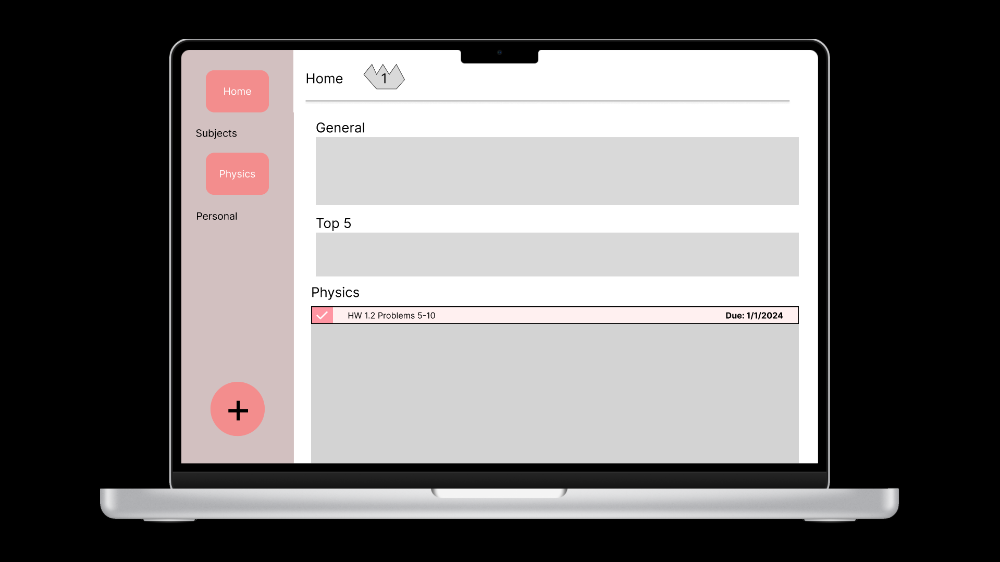

# Taskify

Taskify is a minimalistic todo-list application for those who need help organizing their day-to-day lives. Users can create dividers for top-level organizaton. Within each divider they can create folders. Within each folder they can create tasks. Tasks can optionally be given descriptions and due dates. Life can get messy! You can rearrange folders as your life is rearranged. Taskify also includes streaks that makes it fun to complete tasks.

## Table of Contents

-   [How to Contribute](#how-to-contribute)
-   [Coding Standards](#coding-standards)
-   [Project Documentation](#project-documentation)
-   [Auth Sequence Diagram](#auth-sequence-diagram)
-   [Figma Prototype](#figma-prototype)
-   [UML Class Diagram](#uml-class-diagram)

## How to Contribute

Contributions are welcome! Follow these steps to contribute to the project:

1. **Fork the repository** and clone it to your local machine.
2. **Create a new branch** for your changes: `git checkout -b my-feature`.
3. **Install node packages** for prerequisite packages: `npm install`.
4. **Check `package.json` for scripts** to run code.
5. **Make your changes** and test them thoroughly.
6. **Commit your changes**: `git commit -am 'Add some feature'`.
7. **Push to the branch**: `git push origin my-feature`.
8. **Submit a pull request**.

## Coding Standards

In this project, we adhere to the following coding standards to ensure consistency and maintainability:

### Language Guidelines

#### JavaScript/Node.js Naming Conventions:

-   Use camelCase for variable and function names.
-   Use PascalCase for React components.
-   Use UPPERCASE with \_ (underscore) for constants.
-   Keep variable names concise but descriptive. Include units within the name if necessary.

#### JavaScript/Node.js Best Practices:

-   Prefer `const` and `let` over `var`.
-   Use arrow functions (`() => {}`) for inline functions and callbacks.
-   Use destructuring for object and array assignments where applicable.
-   Use ES6 features like template literals, spread/rest operators, and default parameters where appropriate.
-   Handle errors properly using try/catch or promise rejections.
-   Only import necessary/used modules.
-   Validate prop types for React componenents.

### Code Structure

#### Component Structure:

-   Follow the principles of component-driven architecture.
-   Keep components small, focused, and reusable.
-   Separate presentational components from container components.

### Project Structure

-   Separate concerns by using modules and following the principles of clean architecture.
-   Keep file names concise. Follow naming conventions for each separate folder.

### Dependency Management

-   Use npm or Yarn to manage project dependencies.
-   Pin dependencies to specific versions in `package.json` to ensure consistent behavior across environments.
-   Regularly update dependencies to leverage security fixes and new features.

### Error Handling

#### Error Logging:

-   Log errors with contextual information for easier debugging.
-   Implement error boundaries to catch and handle errors gracefully in React applications.

### Security

#### Security Best Practices:

-   Sanitize user inputs to prevent injection attacks (e.g., SQL injection, XSS).
-   Implement proper authentication and authorization mechanisms.

### Documentation

#### Code Comments:

-   Use comments to explain complex algorithms, business logic, or tricky code segments.
-   Follow a consistent style and formatting for comments throughout the codebase.
-   Avoid unnecessary or redundant comments that don't provide valuable insights.

### Version Control

#### Git:

-   Commit messages should be descriptive.
-   Branch names should be concise and descriptive of the feature or fix they represent.
-   Require code reviews for all pull requests before merging.
-   Utilize Git hooks for automating tasks like linting, formatting, or running tests before commits or pushes.
-   Consider squashing related commits into a single commit before merging feature branches into the main branch. This helps keep the commit history clean and concise.

### Continuous Integration/Continuous Deployment (CI/CD)

#### CI/CD Pipeline:

-   Automate testing, building, and deployment processes using GitHub Actions.
-   Include linting, code analysis, and security checks in the CI pipeline for early detection of issues.

### Code Reviews

-   Conduct code reviews for all changes before merging.
-   Provide constructive feedback and suggestions for improvement.
-   Ensure adherence to coding standards and best practices.

By following these coding standards, we aim to maintain a high level of code quality and readability throughout the project.

## Project Documentation

https://github.com/users/kct417/projects/2

## Auth Sequence Diagram

## Figma Prototype

Taskify's UI design is prototyped in Figma. Click the image below to view the prototype:

Last Updated: 05/10/2024

## UML Class Diagram

https://github.com/kct417/taskify/wiki/UML-Class-Diagram
